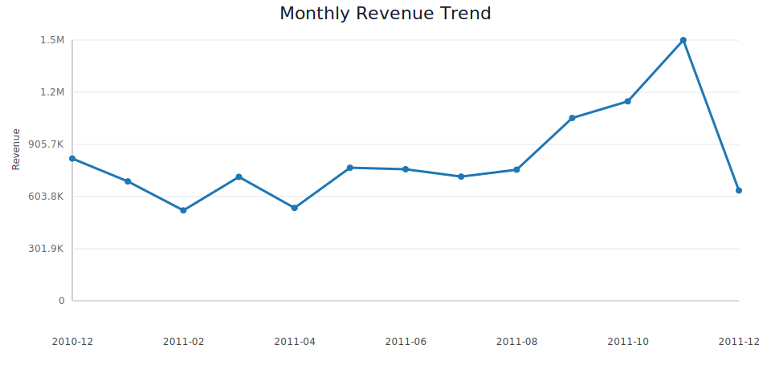
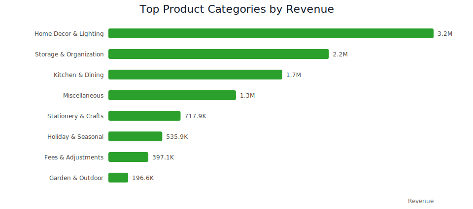
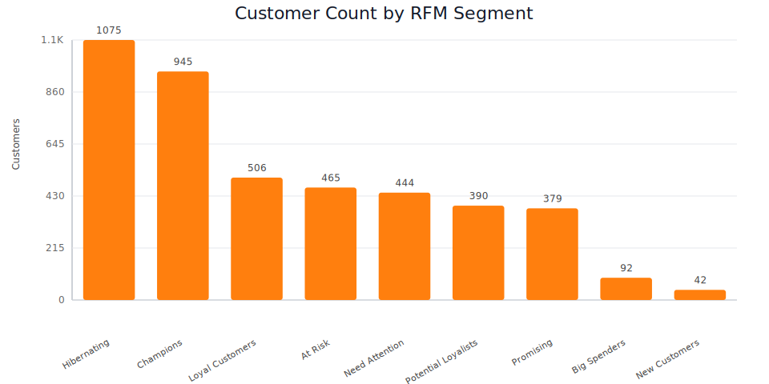

# Retail Sales Performance & Customer Insights Dashboard

An end-to-end data analytics portfolio project built on the `Online Retail` transaction dataset. The project simulates a real stakeholder use case: identify revenue trends, understand customer value, surface top-performing products, and translate the analysis into a Power BI-ready reporting layer.

## Business Objective

The goal is to help a retail business answer four practical questions:

- Which months and seasons drive the most revenue?
- Which products and product categories deserve merchandising focus?
- How dependent is the business on repeat customers?
- Which customer segments should be retained, reactivated, or upsold?

## Project Deliverables

- Cleaned analytical dataset
- Power BI-ready fact and dimension tables
- Python pipeline for cleaning and feature engineering
- EDA notebook
- SQL query pack for business reporting
- README with insights and recommendations
- Power BI dashboard specification and DAX measures

## Tech Stack

- Python: `pandas`, `numpy`
- SQL: SQLite-compatible queries
- Visualization assets: SVG exports for GitHub documentation
- BI Layer: Power BI Desktop

## Project Objective

The goal of this project is to analyze retail transaction data and answer key business questions such as:

- How does revenue change by month and season?
- Which products and product categories contribute the most revenue?
- How dependent is the business on repeat customers?
- Which customer segments should be retained, reactivated, or targeted for growth?
- Where is revenue leakage happening through returns?

## Dashboard Preview

### Executive Overview


### Product Performance


### Customer Insights


### Returns and Risk Monitoring


## Key Results

- Total Revenue: `10.67M`
- Total Orders: `19,960`
- Active Customers: `4,338`
- Average Order Value: `534.40`
- Return Amount: `896.8K`
- Return Rate: `8.41%`

## Business Insights

1. Revenue is strongly seasonal and peaks in Q4, with November 2011 as the highest-performing month.
2. The United Kingdom contributes the majority of total revenue, showing strong domestic concentration.
3. Repeat customers generate the majority of revenue, making retention a critical growth lever.
4. High-value RFM segments such as Champions and Loyal Customers contribute a significant share of business value.
5. Product performance is led by Home Decor & Lighting, Storage & Organization, and Kitchen & Dining.
6. Returns are material enough to justify dedicated risk monitoring.

## Tools Used

- Python (`pandas`, `numpy`)
- SQL
- Power BI
- Jupyter Notebook

## Repository Structure

```text
retail-sales-performance-customer-insights/
|-- data/
|   |-- raw/
|   |   `-- Online_Retail.csv
|   `-- processed/
|       |-- analytics_summary.json
|       |-- data_quality_report.json
|       |-- dim_customer_rfm.csv
|       |-- dim_date.csv
|       |-- dim_product.csv
|       |-- fact_returns.csv
|       |-- fact_sales.csv
|       |-- online_retail_analytics.db
|       `-- online_retail_clean.csv
|-- docs/
|   |-- executive_overview.jpg
|   |-- customer_insights.jpg
|   |-- product_performance.jpg
|   `-- returns_and_risk_monitoring.jpg
|-- notebooks/
|   `-- 01_retail_sales_customer_insights.ipynb
|-- powerbi/
|   |-- Retail_Sales_Performance_Customer_Insights.pbix
|   |-- dax_measures.dax
|   |-- dashboard_spec.md
|   `-- README.md
|-- reports/
|   `-- figures/
|       |-- monthly_revenue_trend.svg
|       |-- rfm_segment_distribution.svg
|       `-- top_categories_revenue.svg
|-- sql/
|   `-- retail_analytics_queries.sql
|-- src/
|   `-- data/
|       |-- build_retail_assets.py
|       `-- generate_notebook.py
|-- .gitignore
|-- README.md
`-- requirements.txt
```

## Data Preparation Summary

The raw dataset contains `541,909` rows spanning `2010-12-01` to `2011-12-09` across `38` countries.

Cleaning and preprocessing steps:

- Loaded the CSV using `ISO-8859-1` encoding
- Standardized column names
- Parsed `invoice_date` into date features for month, quarter, weekday, and hour
- Flagged returns and cancelled invoices
- Derived `line_revenue`, `country_group`, `line_type`, and `product_category`
- Built customer-level RFM metrics and segments
- Exported Power BI-ready star-schema tables

Key data quality flags:

- `1454` rows with missing product descriptions
- `135080` rows with missing customer IDs
- `10624` return or cancellation rows
- `2517` rows with zero or negative unit price

## KPI Snapshot

| KPI | Value |
|---|---:|
| Total Revenue | 10,666,684.54 |
| Total Orders | 19,960 |
| Active Customers | 4,338 |
| Average Order Value | 534.40 |
| Return Amount | 896,812.49 |
| Return Amount / Positive Sales | 8.41% |

## Key Insights

1. Revenue is strongly seasonal and peaks in Q4.
   November 2011 was the best month with `1.51M` in revenue, while February 2011 was the weakest full month at `0.52M`. December 2011 is only a partial month in the source data, so it should not be compared directly against full months.

2. The business is heavily concentrated in the United Kingdom.
   The UK contributes `84.61%` of positive sales revenue, which suggests the core commercial engine is domestic and that international growth is still an expansion opportunity.

3. Repeat customers are the economic backbone of the business.
   For orders tied to a known customer ID, repeat customers generated `74.72%` of revenue. This indicates that retention and reactivation matter at least as much as acquisition.

4. High-value customer segments are highly concentrated.
   The `Champions` segment contains `945` customers but drives `5.74M` in revenue, or `64.45%` of known-customer revenue. These customers deserve dedicated retention, loyalty, and cross-sell treatment.

5. Product performance is led by home and gift-oriented merchandise.
   The top revenue category is `Home Decor & Lighting` at `3.23M`, followed by `Storage & Organization` at `2.19M` and `Kitchen & Dining` at `1.73M`.

6. Returns are not negligible.
   Return value reaches `896.8K`, which is material enough to justify a dedicated monitoring page in the dashboard.

## Top Performing Products

Top merchandise products by revenue:

1. `REGENCY CAKESTAND 3 TIER`
2. `PAPER CRAFT , LITTLE BIRDIE`
3. `WHITE HANGING HEART T-LIGHT HOLDER`
4. `PARTY BUNTING`
5. `JUMBO BAG RED RETROSPOT`

## Visual Highlights

### Monthly Revenue Trend



### Top Product Categories by Revenue



### RFM Segment Distribution



## Business Recommendations

- Prepare inventory, staffing, and campaign intensity for Q4 earlier in the year because demand accelerates sharply from September onward.
- Launch a retention plan for `Champions` and `Loyal Customers` using VIP offers, early access, and bundle cross-sells.
- Build reactivation campaigns for `At Risk` and `Hibernating` customers because they still represent meaningful recoverable revenue.
- Review return-heavy products, countries, and categories to reduce revenue leakage.
- Expand international growth selectively, starting with strong existing markets such as the Netherlands, EIRE, Germany, and France.

## Power BI Dashboard: What Should Be Displayed

The Power BI dashboard should show these elements at minimum:

- KPI cards for revenue, orders, AOV, active customers, return amount, and return rate
- Monthly revenue trend line
- Quarterly or seasonal revenue view
- Top 10 products by revenue
- Revenue contribution by product category
- Revenue by country
- New vs repeat customer behavior
- RFM segment distribution
- Return trend and risk monitoring

Recommended slicers:

- Date
- Country
- Product category
- Customer order type
- RFM segment
- Line type

Full dashboard guidance is available in [powerbi/dashboard_spec.md](powerbi/dashboard_spec.md).

## SQL Coverage

The SQL pack includes queries for:

- Monthly revenue and AOV
- Seasonal performance
- Top products and categories
- Country-level performance
- New vs repeat customer revenue
- RFM segment summaries
- Return amount trend
- High-value customer targeting

See [sql/retail_analytics_queries.sql](sql/retail_analytics_queries.sql).

## How to Reproduce

1. Place the raw dataset in `data/raw/Online_Retail.csv`.
2. Run the pipeline:

```bash
python src/data/build_retail_assets.py
python src/data/generate_notebook.py
```

3. Review the notebook in `notebooks/`.
4. Open Power BI Desktop and import the prepared tables from `data/processed/`.
5. Add the measures from `powerbi/dax_measures.dax`.
6. Build the report pages following `powerbi/dashboard_spec.md`.

## Notes for GitHub and Job Applications

- This repository is structured like a real analytics project rather than a one-off notebook dump.
- The data model is already prepared for BI reporting.
- The Power BI folder includes a clean build spec and measure definitions.
- For GitHub, this text-based structure is easier to review than committing only a binary `.pbix` file.
