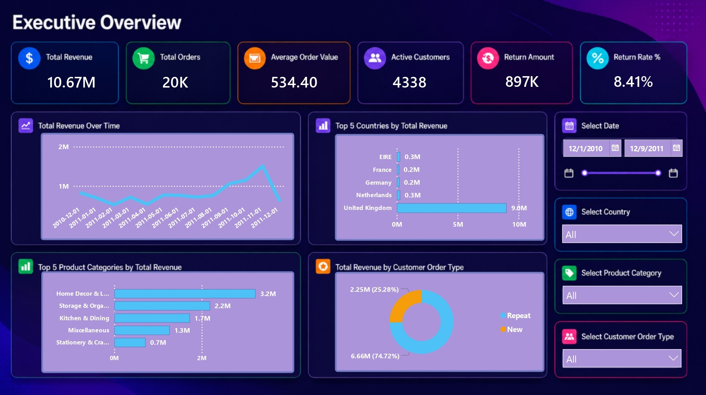
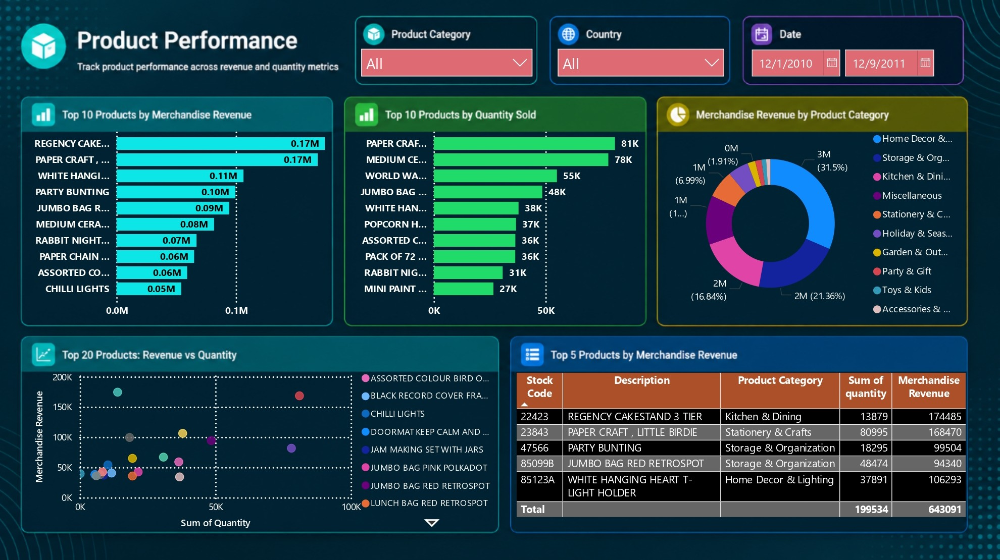
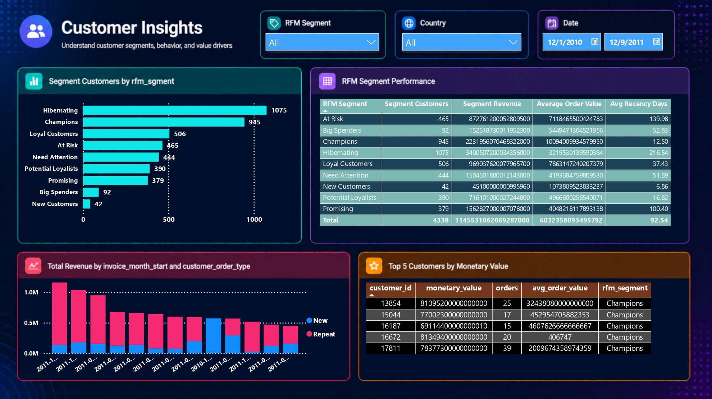
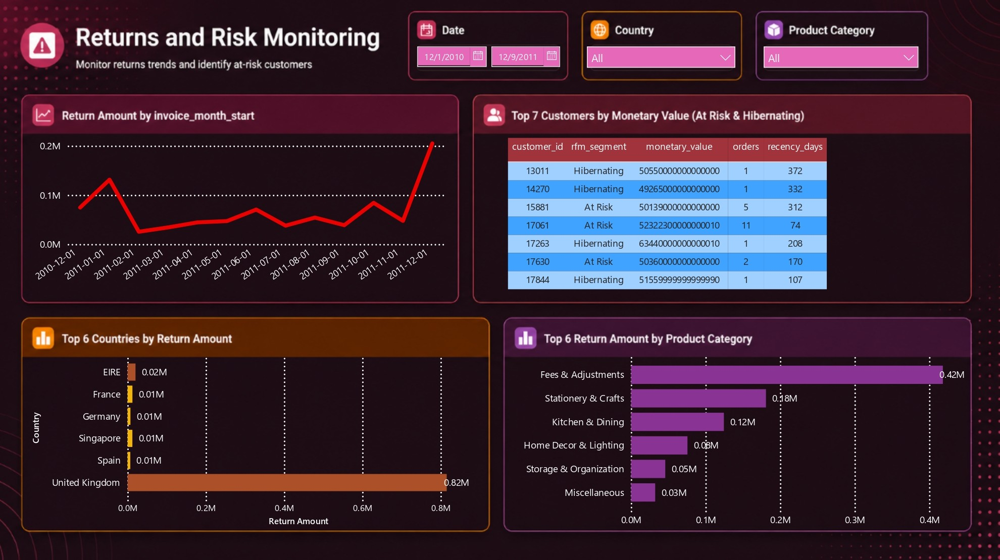

# Retail Sales Performance & Customer Insights Dashboard

An end-to-end retail analytics portfolio project built from the `Online Retail` dataset. The project combines Python, SQL, Power BI, and Streamlit to simulate a stakeholder-facing business analytics workflow that moves from raw transactional data to executive storytelling and interactive decision support.

## Business Problem

Retail leaders need a reliable view of revenue performance, customer behavior, product contribution, return leakage, and growth opportunities. This project turns transactional retail data into a professional analytics stack that answers questions such as:

- Which months and seasons drive the most revenue?
- Which products and categories generate the strongest commercial impact?
- How much of revenue depends on repeat customers?
- Which customer segments deserve retention, reactivation, or upsell action?
- Which countries and product groups contribute the most return risk?

## Dataset

- Dataset: `Online_Retail.csv`
- Source: [Kaggle - Online Retail Dataset](https://www.kaggle.com/datasets/tunguz/online-retail)
- Period covered: `2010-12-01` to `2011-12-09`
- Transactions: `541,909`
- Countries: `38`

## Tools Used

- Python: `pandas`, `numpy`
- SQL
- Power BI
- Streamlit
- Plotly
- Altair
- Jupyter Notebook

## Project Workflow

1. Clean and standardize raw transactional data
2. Create analytical features and revenue metrics
3. Build business-focused SQL queries
4. Design executive Power BI dashboards
5. Build a Streamlit web app for online portfolio deployment
6. Translate findings into business recommendations

## Repository Structure

```text
retail_sales_performance_&_customer_insights_dashboard/
│
├── data/
│   ├── raw/
│   │   └── Online_Retail.csv
│   ├── processed/
│   │   ├── analytics_summary.json
│   │   ├── data_quality_report.json
│   │   ├── dim_customer_rfm.csv
│   │   ├── dim_date.csv
│   │   ├── dim_product.csv
│   │   ├── fact_returns.csv
│   │   ├── fact_sales.csv
│   │   ├── online_retail_analytics.db
│   │   └── online_retail_clean.csv
│   └── cleaned/
│       ├── streamlit_sales.parquet
│       ├── streamlit_returns.parquet
│       ├── streamlit_customer_rfm.csv
│       ├── streamlit_product_monthly.csv
│       ├── streamlit_sales_monthly.csv
│       └── streamlit_summary.json
│
├── docs/
│   ├── executive_overview.jpg
│   ├── customer_insights.jpg
│   ├── product_performance.jpg
│   └── returns_and_risk_monitoring.jpg
│
├── notebooks/
│   └── 01_retail_sales_customer_insights.ipynb
│
├── sql/
│   └── retail_analytics_queries.sql
│
├── powerbi/
│   ├── Retail_Sales_Performance_Customer_Insights.pbix
│   ├── dax_measures.dax
│   ├── dashboard_spec.md
│   └── README.md
│
├── streamlit_app/
│   ├── app.py
│   ├── requirements.txt
│   └── .streamlit/
│       └── config.toml
│
├── reports/
│   └── figures/
│       ├── monthly_revenue_trend.svg
│       ├── rfm_segment_distribution.svg
│       └── top_categories_revenue.svg
│
├── src/
│   └── data/
│       ├── build_retail_assets.py
│       ├── build_streamlit_assets.py
│       └── generate_notebook.py
│
├── app.py
├── requirements.txt
├── .gitignore
└── README.md
```

## Dashboard Preview

### Executive Overview


### Product Performance


### Customer Insights


### Returns and Risk Monitoring


## Key KPI Snapshot

| KPI | Value |
|---|---:|
| Total Revenue | 10,666,684.54 |
| Total Orders | 19,960 |
| Active Customers | 4,338 |
| Average Order Value | 534.40 |
| Return Amount | 896,812.49 |
| Return Rate | 8.41% |

## Business Insights

1. Revenue is highly seasonal, with the strongest momentum in Q4 and a clear peak in November 2011.
2. The United Kingdom is the dominant revenue market, signaling strong domestic concentration.
3. Repeat customers generate most of the revenue, which makes retention strategy commercially critical.
4. The `Champions` and `Loyal Customers` RFM segments contribute a disproportionate share of value.
5. Home Decor & Lighting, Storage & Organization, and Kitchen & Dining are the leading product categories by revenue.
6. Returns are material enough to justify a dedicated monitoring workflow and root-cause analysis by category and country.

## Recommendations

- Prepare inventory, staffing, and promotional activity earlier for Q4 demand spikes.
- Protect high-value customer segments with loyalty, personalization, and cross-sell campaigns.
- Reactivate `At Risk` and `Hibernating` segments with targeted offers and lifecycle messaging.
- Prioritize return reduction analysis for categories with the highest revenue leakage.
- Expand geographic growth selectively, starting from the strongest non-UK markets.

## SQL Analysis Coverage

The SQL layer includes business-focused queries for:

- revenue KPIs
- monthly sales aggregation
- seasonal trend analysis
- top product ranking
- geographic analysis
- new vs repeat customer behavior
- customer segmentation
- RFM analysis
- return monitoring

See [sql/retail_analytics_queries.sql](sql/retail_analytics_queries.sql).

## Power BI Dashboard

The Power BI solution is designed for recruiter showcase and business presentation, with executive pages focused on:

- Executive Overview
- Customer Insights
- Product Performance
- Returns and Risk Monitoring

Files:

- [Power BI dashboard file](powerbi/Retail_Sales_Performance_Customer_Insights.pbix)
- [DAX measures](powerbi/dax_measures.dax)
- [Dashboard specification](powerbi/dashboard_spec.md)

## Streamlit Web App

The Streamlit app is designed as the online showcase version of the project with:

- dark modern analytics UI
- sidebar navigation
- interactive filters
- KPI cards
- product analysis
- customer segmentation
- geographic analysis
- trend and forecasting view
- downloadable insights

Files:

- [Root app entrypoint](app.py)
- [Streamlit app source](streamlit_app/app.py)
- [Theme config](streamlit_app/.streamlit/config.toml)

Streamlit deployment link:

- `Add after deployment`

## App-Ready Data Layer

To make the Streamlit app faster and easier to deploy, the repository includes lightweight app-ready files in `data/cleaned/`. These assets reduce dependence on the largest transaction exports while preserving interactive analytics.

## How to Run

### Python pipeline

```bash
python src/data/build_retail_assets.py
python src/data/build_streamlit_assets.py
python src/data/generate_notebook.py
```

### Streamlit app

```bash
streamlit run app.py
```

### Power BI

1. Open the `.pbix` file in `powerbi/`
2. Refresh data if needed
3. Review dashboard pages and screenshots

## Notes for GitHub

- Large data files may be tracked with Git LFS depending on repository setup.
- The Streamlit app uses `data/cleaned/` assets for a lighter online experience.
- Dashboard screenshots in `docs/` are the recommended visuals to feature in recruiter-facing views.

## Portfolio Summary

This project demonstrates:

- data cleaning and preprocessing
- exploratory data analysis
- SQL business analysis
- dimensional thinking for BI
- Power BI dashboard design
- Streamlit app development
- business storytelling and recommendations